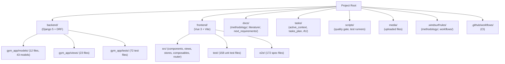

---
description: directory structure to follow
trigger: always_on
---     
# Directory Structure

```mermaid
flowchart TD
    Root[Project Root]
    Root --> Backend["backend/\n(Django 5 + DRF)"]
    Root --> Frontend["frontend/\n(Vue 3 + Vite)"]
    Root --> Docs["docs/\n(methodology/, literature/, next_requirements/)"]
    Root --> Tasks["tasks/\n(active_context, tasks_plan, rfc/)"]
    Root --> Scripts["scripts/\n(quality gate, test runners)"]
    Root --> Media["media/\n(uploaded files)"]
    Root --> Windsurf[".windsurf/rules/\n(methodology/, workflows/)"]
    Root --> GitHub[".github/workflows/\n(CI)"]

    Backend --> Models["gym_app/models/ (12 files, 43 models)"]
    Backend --> Views["gym_app/views/ (23 files)"]
    Backend --> Tests_BE["gym_app/tests/ (72 test files)"]

    Frontend --> Src["src/ (components, views, stores, composables, router)"]
    Frontend --> Tests_FE["test/ (158 unit test files)"]
    Frontend --> E2E["e2e/ (172 spec files)"]
```