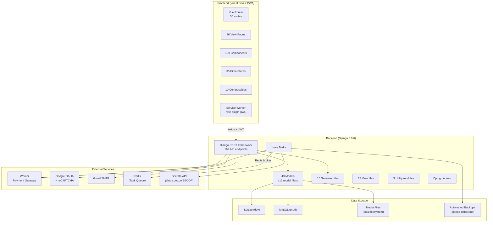
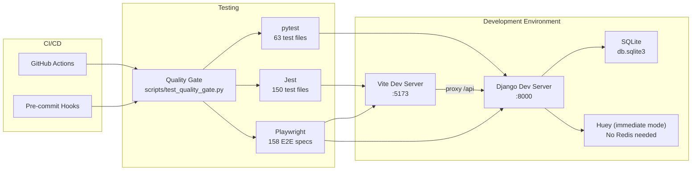
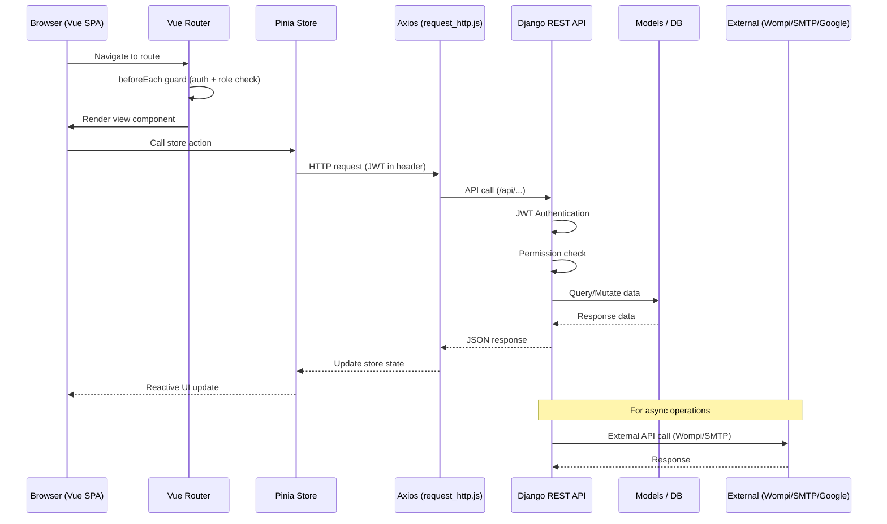
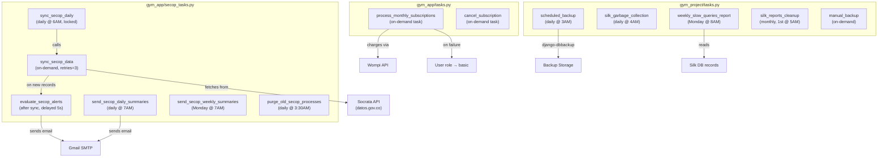
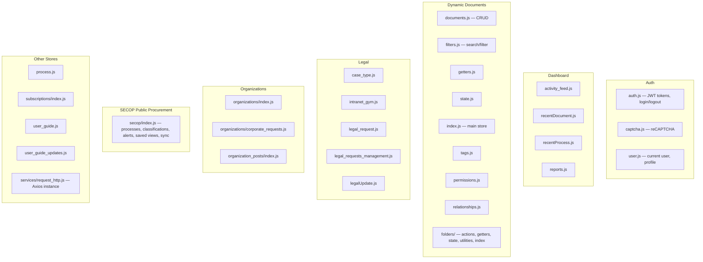
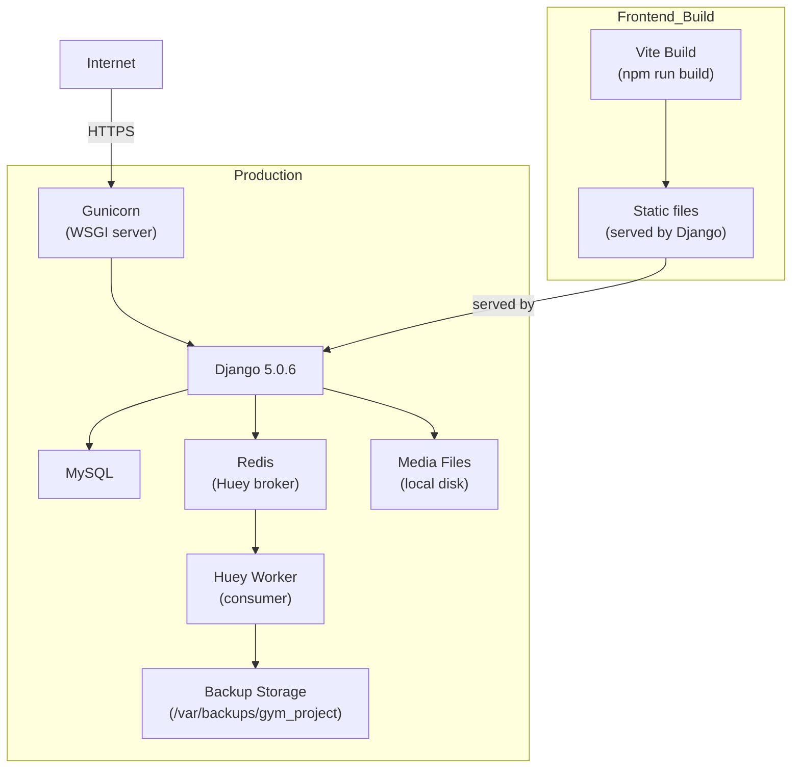

# Architecture — G&M Internal Management Tool

## 1. System Overview

---

## 2. Development Architecture

---

## 3. Request Flow

---

## 4. Entity-Relationship Diagram

```mermaid
erDiagram
    User ||--o{ Process : "lawyer"
    User }o--o{ Process : "clients (M2M)"
    User ||--o{ ActivityFeed : "has"
    User ||--o| UserSignature : "has (OneToOne)"
    User ||--o{ LegalRequest : "creates"
    User ||--o{ CorporateRequest : "sends (client)"
    User ||--o{ CorporateRequest : "receives (corporate_client)"
    User ||--o{ Subscription : "subscribes"
    User ||--o{ DynamicDocument : "creates"
    User ||--o{ DocumentSignature : "signer"
    User ||--o{ DocumentVisibilityPermission : "granted"
    User ||--o{ DocumentUsabilityPermission : "granted"
    User ||--o{ OrganizationMembership : "member of"
    User ||--o{ OrganizationInvitation : "invited_user"
    User ||--o{ OrganizationInvitation : "invited_by"
    User ||--o{ Organization : "corporate_client"
    User ||--o{ RecentProcess : "tracks"
    User ||--o{ RecentDocument : "tracks"
    User ||--o{ PasswordCode : "has"
    User ||--o{ Tag : "created_by"
    User ||--o{ DocumentFolder : "owner"

    Process }o--o{ Stage : "M2M"
    Process }o--o{ CaseFile : "M2M"
    Process }o--|| Case : "belongs to"

    DynamicDocument ||--o{ DocumentVariable : "has"
    DynamicDocument ||--o{ DocumentSignature : "requires"
    DynamicDocument ||--o{ DocumentVisibilityPermission : "has"
    DynamicDocument ||--o{ DocumentUsabilityPermission : "has"
    DynamicDocument }o--o{ Tag : "M2M tags"
    DocumentFolder }o--o{ DynamicDocument : "M2M documents"
    DynamicDocument ||--o{ DocumentRelationship : "source"
    DynamicDocument ||--o{ DocumentRelationship : "target"

    Organization ||--o{ OrganizationInvitation : "sends"
    Organization ||--o{ OrganizationMembership : "has"
    Organization ||--o{ OrganizationPost : "publishes"
    Organization ||--o{ CorporateRequest : "receives"

    LegalRequest }o--|| LegalRequestType : "categorized"
    LegalRequest }o--|| LegalDiscipline : "discipline"
    LegalRequest }o--o{ LegalRequestFiles : "M2M files"
    LegalRequest ||--o{ LegalRequestResponse : "has"

    CorporateRequest }o--|| CorporateRequestType : "categorized"
    CorporateRequest }o--o{ CorporateRequestFiles : "M2M files"
    CorporateRequest ||--o{ CorporateRequestResponse : "has"
    CorporateRequestResponse }o--o{ CorporateRequestFiles : "M2M response_files"

    Subscription ||--o{ PaymentHistory : "has"
```

---

## 5. Model Details

### 5.1 Users Domain (3 models)

| Model | Key Fields | Relationships |
|-------|-----------|---------------|
| `User` | email, first_name, last_name, contact, birthday, identification, document_type (NIT/CC/NUIP/EIN), role (client/lawyer/corporate_client/basic, default='basic'), photo_profile, letterhead_image, letterhead_word_template, is_gym_lawyer, is_profile_completed, created_at | Custom `UserManager`; USERNAME_FIELD='email'; no username/groups/user_permissions |
| `ActivityFeed` | action_type (create/edit/finish/delete/update/download/other), description, created_at | FK → User; max 20 per user (auto-cleanup on save) |
| `UserSignature` | signature_image, method (upload/draw), ip_address, created_at | OneToOne → User |

### 5.2 Processes Domain (5 models)

| Model | Key Fields | Relationships |
|-------|-----------|---------------|
| `Case` | type | — (lookup table for case types) |
| `Process` | authority, authority_email, plaintiff, defendant, ref, subcase, progress (0-100), created_at | FK → Case, FK → User (lawyer), M2M → User (clients), M2M → Stage, M2M → CaseFile |
| `Stage` | status, date, created_at | No FK — linked via Process M2M |
| `CaseFile` | file, created_at | No FK — linked via Process M2M; physical file deleted on model delete (signal) |
| `RecentProcess` | last_viewed | FK → User, FK → Process; unique_together=[user, process] |

### 5.3 Dynamic Documents Domain (9 models)

| Model | Key Fields | Relationships |
|-------|-----------|---------------|
| `Tag` | name (unique), color_id | FK → User (created_by, SET_NULL) |
| `DynamicDocument` | title, content, is_public, letterhead_image, letterhead_word_template | FK → User (created_by), M2M → Tag (tags) |
| `DocumentVariable` | name, type (input/text_area/number/date/email/select), value, summary_field (none/counterparty/object/value/term/subscription_date/start_date) | FK → DynamicDocument |
| `DocumentSignature` | signed (bool), signed_at, rejected (bool), rejected_at | FK → DynamicDocument, FK → User (signer) |
| `DocumentVisibilityPermission` | — | FK → DynamicDocument, FK → User |
| `DocumentUsabilityPermission` | — | FK → DynamicDocument, FK → User |
| `RecentDocument` | viewed_at | FK → User, FK → DynamicDocument |
| `DocumentFolder` | name, color_id | FK → User (owner), M2M → DynamicDocument (documents) |
| `DocumentRelationship` | (no extra fields) | FK → DynamicDocument (source_document), FK → DynamicDocument (target_document); bidirectional |

### 5.4 Organizations Domain (4 models)

| Model | Key Fields | Relationships |
|-------|-----------|---------------|
| `Organization` | title, description, profile_image, cover_image, is_active, created_at, updated_at | FK → User (corporate_client, limit_choices_to={'role': 'corporate_client'}) |
| `OrganizationInvitation` | invitation_token (UUID), message, status (PENDING/ACCEPTED/REJECTED/EXPIRED/CANCELLED), expires_at, responded_at, created_at | FK → Organization, FK → User (invited_user), FK → User (invited_by); unique_together=[organization, invited_user, status] |
| `OrganizationMembership` | role (LEADER/ADMIN/MEMBER), joined_at, is_active, deactivated_at | FK → Organization, FK → User; unique_together=[organization, user] |
| `OrganizationPost` | title, content, link_name, link_url, is_active, is_pinned, created_at, updated_at | FK → Organization, FK → User (author, limit_choices_to={'role': 'corporate_client'}) |

### 5.5 Legal Requests Domain (5 models)

| Model | Key Fields | Relationships |
|-------|-----------|---------------|
| `LegalRequestType` | name (unique) | — |
| `LegalDiscipline` | name (unique) | — |
| `LegalRequest` | request_number (auto-gen SOL-YYYY-NNN), description, status (PENDING/IN_REVIEW/RESPONDED/CLOSED), status_updated_at, created_at | FK → User, FK → LegalRequestType, FK → LegalDiscipline, M2M → LegalRequestFiles |
| `LegalRequestFiles` | file, created_at | No FK — linked via LegalRequest M2M; physical file deleted on model delete (signal) |
| `LegalRequestResponse` | response_text, user_type (lawyer/client), created_at | FK → LegalRequest, FK → User |

### 5.6 Corporate Requests Domain (4 models)

| Model | Key Fields | Relationships |
|-------|-----------|---------------|
| `CorporateRequestType` | name (unique) | — |
| `CorporateRequest` | request_number (auto-gen CORP-YYYY-NNN), title, description, priority (LOW/MEDIUM/HIGH/URGENT), status (PENDING/IN_REVIEW/RESPONDED/RESOLVED/CLOSED), status_updated_at, estimated_completion_date, actual_completion_date, created_at | FK → User (client), FK → User (corporate_client), FK → User (assigned_to, nullable), FK → Organization, FK → CorporateRequestType, M2M → CorporateRequestFiles |
| `CorporateRequestFiles` | file, created_at | No FK — linked via CorporateRequest M2M; physical file deleted on model delete (signal) |
| `CorporateRequestResponse` | response_text, user_type (corporate_client/client), is_internal_note, created_at | FK → CorporateRequest, FK → User, M2M → CorporateRequestFiles (response_files) |

### 5.7 Subscriptions Domain (2 models)

| Model | Key Fields | Relationships |
|-------|-----------|---------------|
| `Subscription` | plan_type (basico/cliente/corporativo), amount, status (active/cancelled/expired), payment_source_id, next_billing_date, created_at, updated_at | FK → User |
| `PaymentHistory` | amount, status (approved/declined/pending/error), transaction_id, reference, payment_date, error_message | FK → Subscription |

### 5.8 Intranet Domain (2 models)

| Model | Key Fields | Relationships |
|-------|-----------|---------------|
| `LegalDocument` | name, file | — |
| `IntranetProfile` | cover_image, profile_image | Singleton (no FK to User) |

### 5.9 SECOP Public Procurement Domain (6 models)

| Model | Key Fields | Relationships |
|-------|-----------|---------------|
| `SECOPProcess` | process_id (unique), reference, entity_name, entity_nit, department, city, entity_level, procedure_name, description, phase, status, procurement_method, contract_type, base_price, closing_date, publication_date, process_url, raw_data (JSON) | — |
| `ProcessClassification` | status (INTERESTING/UNDER_REVIEW/DISCARDED/APPLIED), notes, created_at, updated_at | FK → SECOPProcess, FK → User (unique_together) |
| `SECOPAlert` | name, keywords, entities, departments, min_budget, max_budget, procurement_methods, frequency (IMMEDIATE/DAILY/WEEKLY), is_active | FK → User |
| `AlertNotification` | is_sent, sent_at, created_at | FK → SECOPAlert, FK → SECOPProcess (unique_together) |
| `SyncLog` | started_at, finished_at, status (IN_PROGRESS/SUCCESS/FAILED), records_processed/created/updated, error_message | — |
| `SavedView` | name, filters (JSON), created_at | FK → User (unique_together with name) |

### 5.10 Other Models (3 models)

| Model | Key Fields | Relationships |
|-------|-----------|---------------|
| `LegalUpdate` | title, content, image, link_text, link_url, is_active, created_at, updated_at | No FK (standalone) |
| `PasswordCode` | code (6-digit), created_at, used (bool) | FK → User |
| `EmailVerificationCode` | email, code (6-digit), created_at, used (bool) | No FK to User — stores email directly (pre-registration) |

---

## 6. Service Layer (Huey Tasks)

---

## 7. Frontend Page Routing

```mermaid
flowchart TD
    Root["/"] -->|"redirect"| SignIn["/sign_in"]
    
    subgraph Public["Public Routes (no auth)"]
        SignIn
        SignOn["/sign_on"]
        Forget["/forget_password"]
        Home["/home"]
        Privacy["/policies/privacy_policy"]
        Terms["/policies/terms_of_use"]
        NoConn["/no_connection"]
        Subs["/subscriptions"]
        SubSignIn["/subscription/sign_in"]
        SubSignUp["/subscription/sign_up"]
        GoogleCB["/auth/google/callback"]
    end

    subgraph Auth["Authenticated Routes (SlideBar layout)"]
        Dashboard["/dashboard"]
        ProcessList["/process_list/:user_id?"]
        ProcessDetail["/process_detail/:process_id"]
        ProcessForm["/process_form/:action 🔒"]
        Directory["/directory_list 🔒"]
        LegalReq["/legal_request"]
        LegalReqList["/legal_requests"]
        LegalReqCreate["/legal_request_create"]
        LegalReqDetail["/legal_request_detail/:id"]
        Intranet["/intranet_g_y_m 🔒"]
        Schedule["/schedule_appointment"]
        OrgDash["/organizations_dashboard"]
        DocDash["/dynamic_document_dashboard"]
        Checkout["/checkout/:plan"]
        SecopList["/secop 🔒"]
        SecopDetail["/secop/:id 🔒"]
        UserGuide["/user_guide"]
    end

    DocDash -->|"children"| DocEditor["editor/create/:title 🔒\neditor/edit/:id 🔒\nclient/editor/edit/:id\ndocument/use/:mode/:id/:title\nvariables-config 🔒\nsigned-documents"]
```

> 🔒 = `requiresLawyer: true` (Client/Basic/Corporate redirected to dashboard)

---

## 8. Store Architecture

---

## 9. Deployment Architecture

> Frontend is built and served as static files through Django in production. The `npm run build` command also runs `scripts/generate-django-template.cjs` to create a Django-compatible template.
